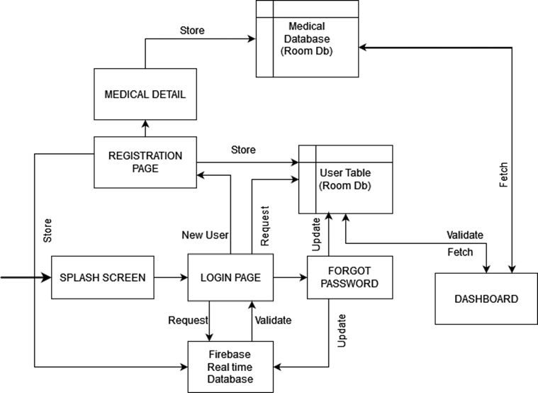
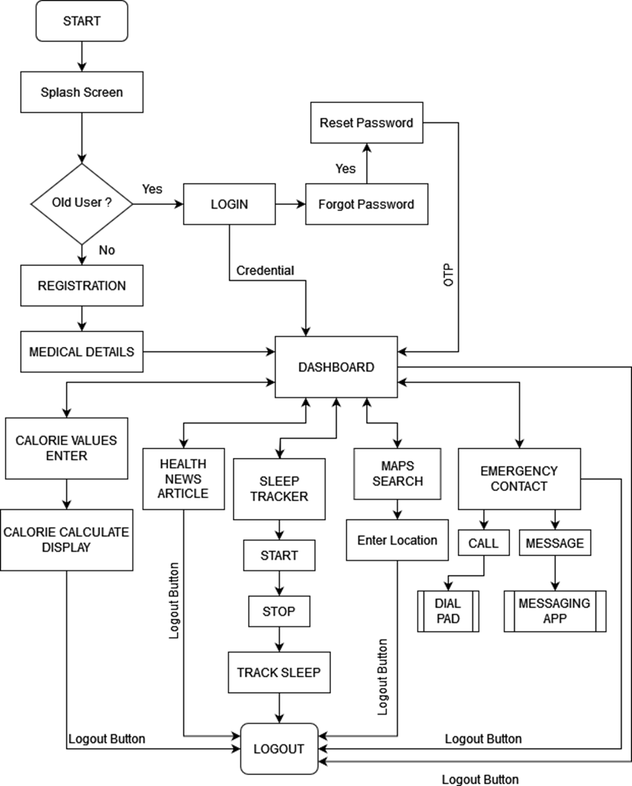

# Health_Care_App
1.	INTRODUCTION :
1.1	Overview
The Application is used to keep users aware about their Health status, maintain a Good Lifestyle in Day-to-Day Life.
1.2	Purpose
Users can get a clear overall idea about their Health Status, take care of themselves without any dependency on others. The App has a lot of useful modules with a user-friendly interface.
2.	LITERATURE SURVEY :
2.1	Existing problem
As the Country is populated, it is important to make resources available to people in an easier way. The Medical Industry is one of the critical factors of a Country. A Lot of people are unaware about how a poor Lifestyle can have impacts on their health in the Future. A lot of Medical Related Applications are available in the Market, but they target only a certain Department like Medicine Order, Doctor Consultation, what if we can bring all the Features within a Single Application.
2.2	Proposed solution
Thus, we propose Health Medicare App, an All-in-one Medical App, to solve all the Problems related to Health and Lifestyle. We will include all the Required features from Meditation Tracking to Doctor Consultation and Medicine Order. For now, we have done only 7 Modules including User Registration.
3.	THEORITICAL ANALYSIS :
3.1	Block diagram (Database Control Flow)

4. 4.	EXPERIMENTAL INVESTIGATIONS :
1)	User Registration / Forgot Password / Login: We have to analyse which Database to use, so that it can store user’s information properly. Also, it has to be stored in the Cloud as well as User’s Device. So, we used both Room Db and Firebase Realtime Database to store Login Credentials. User Login Details in separate Table and Medical Details in another Table.
2)	Dashboard: To display user’s information on Successful Login in the Dashboard, we used Room Db. We give the User Email Address, to fetch all the user Related Details from the Database and reflect it back.
3)	Calorie Manage Page : Collecting the Details from the User. Calculating all the Calorie Data in the Background, and displaying back to the user.
4)	  Health Article : We used (An Open-source API) to Load the Health Articles. We did research on finding the Best API to integrate within the App with proper architecture.
5)	Sleep Tracker : We did some analysis on how to capture current Timestamp in a variable, convert them into Date, find difference, and display back to the User.
6)	Map Search : We did some research on how to integrate Google Maps into an Android App. Also, how to display the Nearby hospitals at a given Location.
7)	Emergency Dial : We did some research on finding all the important HealthCare Toll free numbers in the Country, how to integrate Messaging and Call option directly. We used Intent to successfully transfer the Mobile number.
8)	OTP (Forgot Password) : We used SMS-Manager to directly send OTP to the user’s Mobile Number.
9)	Daily Reminder Notifications : We are using Google Firebase Cloud Messaging to send Automatic Scheduled Notifications to all the users.
10)	Permissions : We ask user SMS, Notification Allow Permission.
5.	FLOWCHART :
Diagram showing the Control flow of the Project

6.	RESULT :
   

7.	ADVANTAGES & DISADVANTAGES :
   
•	ADVANTAGES :
Calorie Tracking : User can know the BMI, amount of Calorie to be consumed based on Physical Activity and Diet Type. Carbohydrate, Protein, Fat Consumption in Calorie and Gram per day.
Health News : Users are aware about Latest Daily Health News in and around the World easily.
Sleep Track : Users can track their Nap / Sleep easily and maintain a healthy Sleep Schedule.
Maps Search : User can easily Locate Hospitals in and around their location with a minimal time in case of Emergency.
Emergency Dial : In case of Emergency, the user can directly call/message the important helpline from the Application.
Health Notifications : Notifications include Wake Up (7.30 AM Daily), Health News (8.00 AM Daily), Drink Water Reminder (12.30 PM Daily), Calorie Manage (12.00 PM every Sunday). These notifications are helpful to the user.

•	DISADVANTAGES :
Unable to Consult a doctor: Users cannot Book an Appointment / Consult a doctor.
Unable to Order Medicine : Users cannot Order Medicine that are prescribed by the Doctor.
Unable to make Payments : Users cannot make Payments via the App. A user cannot pay the Doctor Consultation Fee / Medicine Purchase Payment.
Login Every time : The user has to login Every time with his credentials.

08.	APPLICATIONS :
The App when deployed along with the Above Disadvantages can be launched in Play store.
Any Person can download the App and can make full use of it. Any user who wants to maintain a Healthy Lifestyle with all the Facilities can make use of this App.

09.	CONCLUSION :
Summarizing Entire Work, we have developed a Medical Care Application, which can act as one Stop Application for All health-related issues. For Now, we have done only 7 modules (Login, Dashboard, Calorie Manage, Health News Article, Sleep Tracker, Maps Search, Emergency Dial). Along with the Reminder Notifications, the App can be useful in Day- to-Day Life.

10.	FUTURE SCOPE :
In the Future, we are planning to overcome current Disadvantages by including Doctor Search according to Specific Location, Direct Consultation with Doctor (Call/Video), Book an Appointment with Doctor, Order Medicine According to the Doctor Prescription, Cart, Track Medicine Order, Payment Portal, Health Insurance. With this the App becomes a Complete Package, thus can be launched in Play store.

